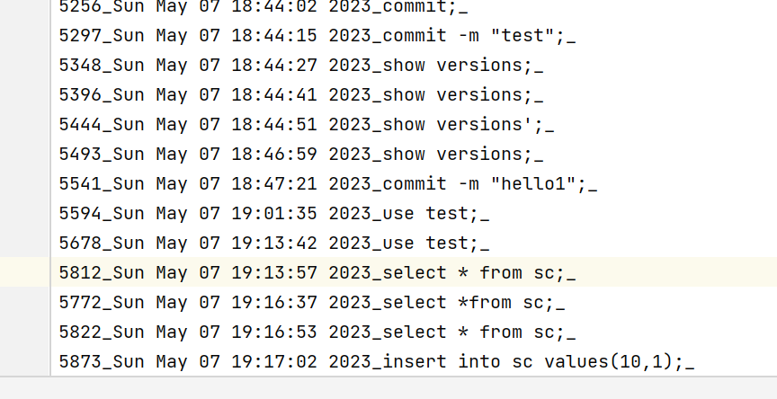
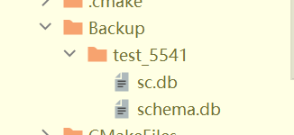

# sql-project
DBMS	
gxc第一次尝试上传合并操作
hyx第二次上传
xyh第一次上传
cj第一次上传
$$
# 编写平台

●使用gitee平台进行管理,现所有人已加入 日后请按规范上传 不要push -f
●使用c++ 语言开发,
●项目管理 我们组拟基于cmake 进行项目管理编写
功能要求
1.（非必要功能）用户的创建、授权，默认用户为root
2.(非必要功能) 库的导出（Excel）
3.（非必要功能）数据库 新建和删除(√)
4.（非必要功能）表 结构的修改与表的删除(√)
5.(必要功能） 表的创建(√)
6.(必要功能）GUI的实现（基于QT）暂时拿英文写 (后期方便使用gxc和xyh的webassembly(√)
7.（必要功能）字段的基本增删改查,就是单纯的select * from sc where cno = '11';insert into sc valuse,...这样的(√)
8.（非必要功能）增删改查的进阶 group by，聚合函数 、having，select嵌套
9.(进阶功能） 网页端  ？功能
10.（非必要功能）系统志(√)
11.（必要功能）数据字典
12. (非必要功能） 数据库支持大小写敏感(√)
13.（非必要功能）登录功能(√)
14.（非必要功能）*数据库需要支持远程登陆功能* 也就是远程登陆访问操作别人的数据库(√)
15.（非必要功能）实现回退功能 roll back功能和commit功能(√)

# 实现流程
第一阶段
先实现命令行中的实现，有个大类叫db8,调用db8.start来进行启动

## 内存B+树的使用
B+树已经实现,通过泛型实现,如果需要调用B+树,我们需要先给B+树传入参数类型
BPlusTree<Index_Type,Data_Type>,分别制定索引的数据类型和存储数据的结构类型
想要向b+树种插入数据,可以使用bool insert(Index,Data)插入
想要删除数据,通过bool remove(Index)实现删除指定索引的数据
想要查找数据是否存在,通过bool find(Index)可以实现数据的查找
想要范围查找,通过vector<Data> rangeSearch(Index pre,Index last)查找,返回一个vector<Data>

## 基于外存的B+树实现
该实现比较复杂,我们基于第一版内存B+树来修改
具体实现的思想如下:我们在BPlusTree(2).h中声明了文件系统与内存的接口,通过直接调用函数来获得或者修改node
注意,我们传入的fileName结构如下:
根据所需要的联合索引字段来生成索引名称,比如sno和cno组合为联合索引,那么我们就需要传入名称sno_cno_,我们会通过variableType来生成动态数据类型充当索引进行比较的操作.每个节点的大小为4k,每次都是写入4k或者读取了4k,可以无限存储数据,充当一个真正的数据库
反正调用者只需要直接调用BPT内部对应的函数就可以了
构造函数:BplusTree bp(vector<Attributes*>,tableName)
索引文件存储在tableName_attName1_attName2...._attNamen_.index中
索引结构存在tableName_attName1_attName2...._attNamen_.type中
为了加速B+树的查询与尽可能减少内存io次数,加入了IRU缓存技术,该技术实现逻辑简单,使用hash表和双向链表实现了o(1)的插入和删除,将最新使用的节点放到链表头,然后当内存池满的时候删除最后一个节点.当数据库关闭的时候记得清除缓存池.

## 数据存储
所有的表操作和数据存储操作全部封装在table中,直接调用table对应的方法即可

Attribute 用来存放列结构信息,包括但不限于:列名,列长,列数据类型,主键,唯一
variableType 用来存放动态创建的数据类型,需要对应传入vector<Attribute*> 和 vector<string>,应该为一一对应的关系,在这个类中我们重载了各种比较符号,能够进行比较与赋值的操作

## Catalog读取与存放表结构数据
Catalog用来存放所有的表信息,调用构造函数的时候会自动读取schema.db下的文件,获得所有的表结构信息

## sqlCompiler的数据返回参考——vector<string>
preSelect语句返回类型为：1 属性名 2 表名 3 where子句 4 group by子句 5 having 6 order by子句，在每个子句后面都会有一个相应的数字代表接下来的数据类型，若缺失则为没有改数据类型

## case 8需要设置返回类型

## 备份使用说明
我们的备份操作主要以来与backup文件夹下的备份
使用条件在于,在运行的时候 在db8调用recovery(name)方法
name处需要传入你使用的backup版本,
接着直接使用即可
需要注意的是回滚是根据日志中的备份进行的,是对数据库的备份,
因此 使用前需要先 use sc;
先use一下自己之前需要使用的数据库  才能够进行备份

## 版本回滚使用说明
我们的版本回滚主要是基于日志的版本回滚
各位可以看到 在我的日志记录前有许多版本号 
而我们备份的时候,备份文件后面那个 就是你备份的版本号
我们的回滚方法是  rollback(test_1230,2723);
test_1230 意思是test数据库的1230版本
如果你的数据库中存在2723版本,你可以先use 对应的数据库
然后直接调用rollback方法即可

## 如何提交版本
和git 一样
commit -m "输入的版本信息"
使用
show versions
来查询所有的版本信息
然后使用
rollback回退到指定的位置

## 如何备份
首先use 一下目标数据库
然后 在当前数据库下输入
backup
命令操作即可！

## 如何回滚  (比起recover 更推荐这个)
首先我们需要知道自己备份的名字
和我们想要回退的版本号
远程客户端用户可以先commit -m "信息"
然后再用show version 的方式获得你需要的版本号
比方选择了 5812版本
或者你也可以直接查看日志 获得对应的版本信息

比方我就要日志对应5812的地方的

比方我这里是这样的
那我们就需要输入
rollback test_5541 5812
注意5812需要大于5541 test_5541表示的是使用5541版本备的份
然后就可以发现复原成功了

## 如何复原
使用recover+备份名
比方说 
recover test_5541
就可以恢复了
